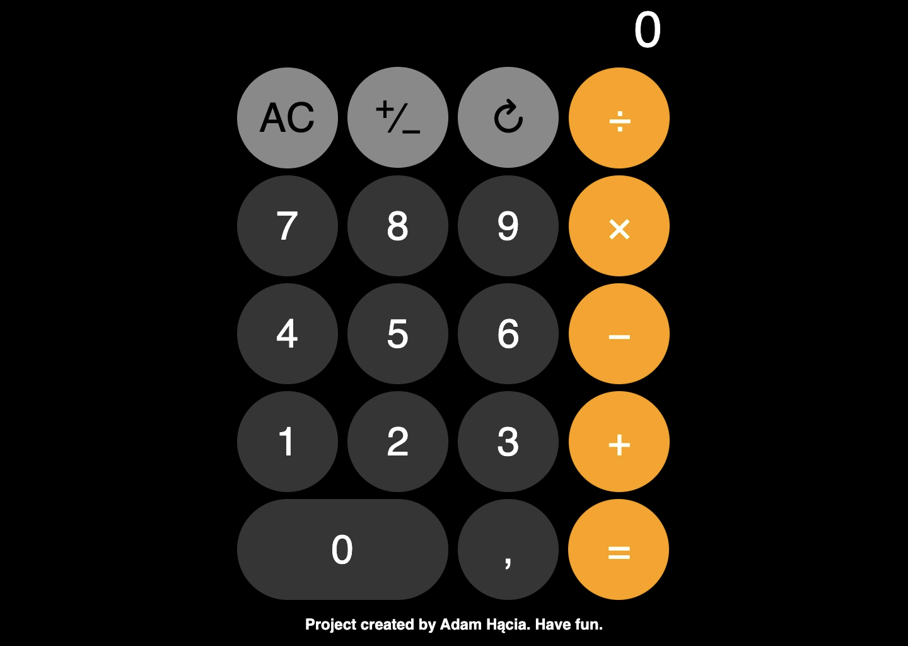
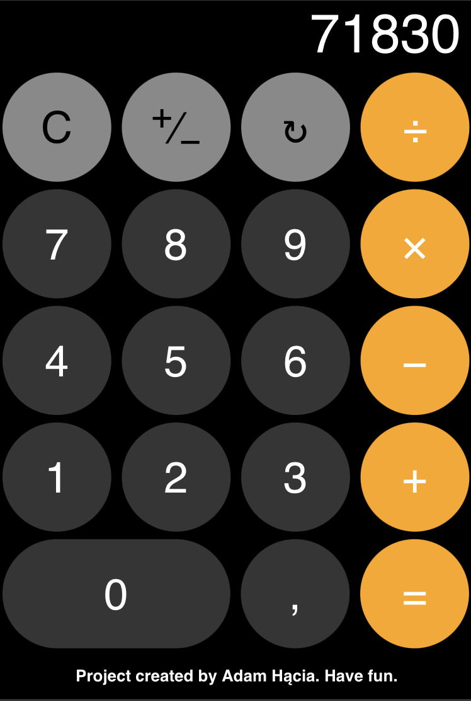

# Calculator
> Simple calculator created in JavaScript. I tried to make it look like the copy of iPhone's calculator. Works on computers and mobiles.
## Table of contents
- [Calculator](#calculator)
  - [Table of contents](#table-of-contents)
  - [Try it](#try-it)
  - [Screenshots](#screenshots)
  - [Technologies](#technologies)
  - [Features](#features)
  - [Status](#status)
  - [Inspiration](#inspiration)
  - [Contact](#contact)

## [Try it](https://hacia.students.wmi.amu.edu.pl/projects_extra/calculator/sth.html)

## Screenshots

Computer

Mobile

## Technologies
* JavaScript 
* CSS

## Features
* Just a simple calculator 

## Status
Project is: _completed_

## Inspiration
I wanted to learn some basic JavaScript.

## Contact
Created by [@HondaPL](https://hacia.students.wmi.amu.edu.pl/) 2020

